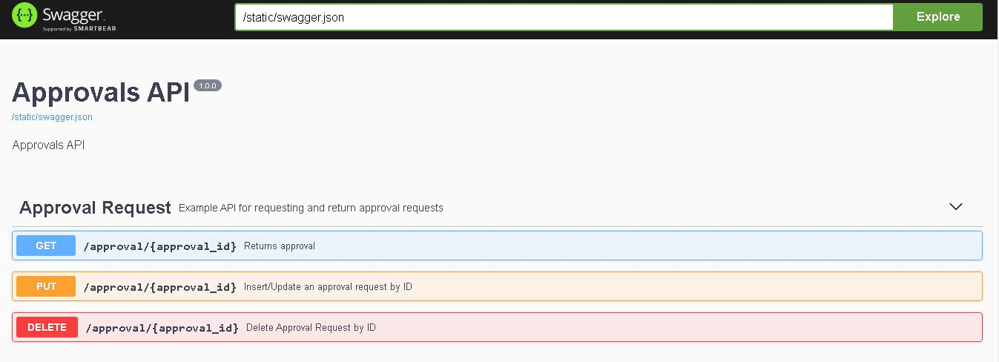

# Approvals API

This project is a web service written with flask for the Approvals project.

## Installation ans Start

```bash
pip install -r requirements.txt 
python run.py
```

## Unit Test

```bash
python tests/test_approval_api.py
```

## Swagger UI

Hosted Locally [http://127.0.0.1:5000/swagger/](http://127.0.0.1:5000/swagger/)


